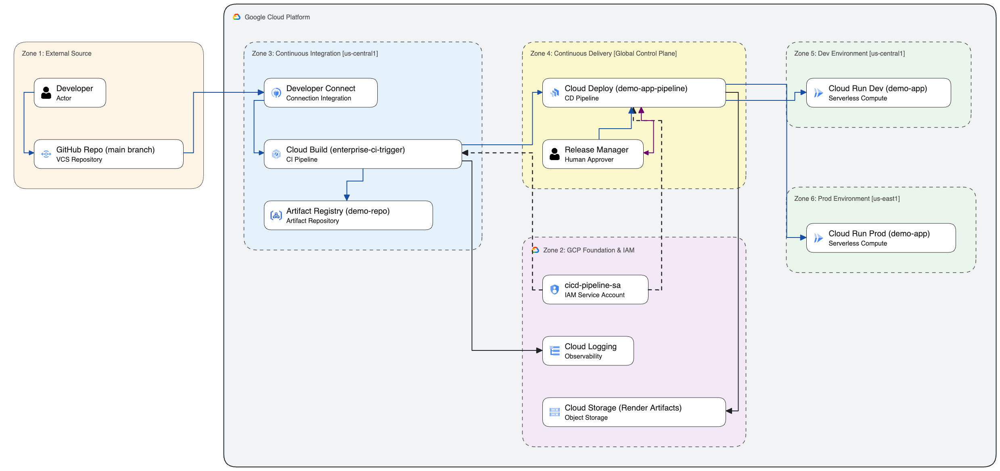

# Enterprise CI/CD on Google Cloud (Demo)

This repository contains the source code, templates and instructions to demo a fully serverless, enterprise-grade CI/CD pipeline on Google Cloud. 

It demonstrates deploying a basic Flask (Python) application from GitHub to Cloud Run, separating Continuous Integration (CI) from Continuous Delivery (CD), using least-privilege security, and implementing a manual approval step for production releases.

## Architecture



---

### Best Practices Implemented
* **Separation of CI and CD:** Cloud Build strictly handles CI (building and pushing the image to Artifact Registry) while Cloud Deploy handles CD (promoting that image across environments).
* **Developer Connect:** Uses Google's latest recommended V2 API to securely connect GitHub to Google Cloud.
* **Least Privilege Security:** Both Cloud Build and Cloud Deploy execute using a custom Service Account, rather than Google's default compute account.
* **Supply Chain Security:** Binary Authorization acts as a last line of defense for untrusted images, ensuring Cloud Run will only execute container images that meet the criteria to be deployed. In this demo, the Binary Authorization policy limits deployes to images built by the CI pipeline and stored in the approved Artifact Registry.

---

## Repository Structure

* `src/main.py` - The Python Flask web application.
* `Dockerfile` - Simple container configuration using `gunicorn`.
* `cloudbuild.yaml` - Declarative pipeline configuration for Google Cloud Build.
* `service.yaml` - The Cloud Run Knative manifest.
* `skaffold.yaml` - Tells Cloud Deploy how to render and deploy `service.yaml`.
* `clouddeploy.yaml` - Infrastructure-as-code file defining the Dev and Prod pipeline stages.
* `binauthz-policy.yaml` - The list of attestations used by Binary Authorization to approve or reject deployments.

---

## Setup Instructions

To deploy this architecture in your own Google Cloud project, follow these steps using Google Cloud Shell or your local terminal authenticated with `gcloud`.

### 1. Set Environment Variables
```bash
export PROJECT_ID=$(gcloud config get-value project)
export DEV_REGION="us-central1"
export PROD_REGION="us-east1"
export SA_NAME="cicd-pipeline-sa"
export SA_EMAIL="${SA_NAME}@${PROJECT_ID}.iam.gserviceaccount.com"
```

### 2. Enable Required Google Cloud APIs
```bash
gcloud services enable \
    cloudbuild.googleapis.com \
    artifactregistry.googleapis.com \
    run.googleapis.com \
    clouddeploy.googleapis.com \
    developerconnect.googleapis.com \
    secretmanager.googleapis.com \
    binaryauthorization.googleapis.com
```

### 3. Create Custom Service Account & Grant Permissions
```bash
# Create the Service Account
gcloud iam service-accounts create $SA_NAME \
    --display-name="CI/CD Pipeline Service Account"

# Grant Artifact Registry Writer (to push images)
gcloud projects add-iam-policy-binding $PROJECT_ID \
    --member="serviceAccount:${SA_EMAIL}" \
    --role="roles/artifactregistry.writer"

# Grant Cloud Deploy permissions
gcloud projects add-iam-policy-binding $PROJECT_ID \
    --member="serviceAccount:${SA_EMAIL}" \
    --role="roles/clouddeploy.releaser"
gcloud projects add-iam-policy-binding $PROJECT_ID \
    --member="serviceAccount:${SA_EMAIL}" \
    --role="roles/clouddeploy.jobRunner"

# Grant Cloud Run deploy permissions
gcloud projects add-iam-policy-binding $PROJECT_ID \
    --member="serviceAccount:${SA_EMAIL}" \
    --role="roles/run.admin"
gcloud projects add-iam-policy-binding $PROJECT_ID \
    --member="serviceAccount:${SA_EMAIL}" \
    --role="roles/iam.serviceAccountUser"

# Grant Logging and Storage permissions (Required by Cloud Build and Cloud Deploy)
gcloud projects add-iam-policy-binding $PROJECT_ID \
    --member="serviceAccount:${SA_EMAIL}" \
    --role="roles/logging.logWriter"
gcloud projects add-iam-policy-binding $PROJECT_ID \
    --member="serviceAccount:${SA_EMAIL}" \
    --role="roles/storage.admin"
```

### 4. Create the Artifact Registry
```bash
gcloud artifacts repositories create demo-repo \
    --repository-format=docker \
    --location=$DEV_REGION \
    --description="Enterprise Demo Docker repo"
```

### 5. Apply Cloud Deploy Pipeline Configuration
This creates the logical pipeline connecting the Dev and Prod environments. 
*(Ensure you have updated the `clouddeploy.yaml` with your correct `$PROJECT_ID` and `$SA_EMAIL` if applying manually).*

```bash
gcloud deploy apply --file=clouddeploy.yaml --region=$DEV_REGION
```

### 6. Connect GitHub to Google Cloud
1. Go to **Developer Connect** in the Google Cloud Console.
2. Click **Create Connection** -> select **GitHub**.
3. Name it `github-conn`, choose region `us-central1`, and follow the prompts to authorize your repository.

### 7. Create the Cloud Build Trigger
1. Go to **Cloud Build > Triggers** in the console and click **Create Trigger**.
2. **Name:** `enterprise-ci-trigger`
3. **Event:** Push to branch (regex: `^main$`)
4. **Source Generation:** `2nd gen (Developer Connect)` -> Select your repo.
5. **Configuration:** `Cloud Build configuration file (yaml or json)` -> `/cloudbuild.yaml`
6. **Advanced > Service Account:** Select `CI/CD Pipeline Service Account`.
7. Click **Create**.

### 8. Configure Binary Authorization
To prevent any unauthorized images from running in your environment, create a policy that explicitly denies everything except images originating from your Artifact Registry.

```bash
cat <<EOF > binauthz-policy.yaml
defaultAdmissionRule:
  evaluationMode: ALWAYS_DENY
  enforcementMode: ENFORCED_BLOCK_AND_AUDIT_LOG
admissionWhitelistPatterns:
- namePattern: "${DEV_REGION}-docker.pkg.dev/${PROJECT_ID}/demo-repo/*"
EOF

gcloud container binauthz policy import binauthz-policy.yaml
```

**Important:** Ensure your `service.yaml` file in GitHub includes the Binary Authorization annotation so the service enforces the policy:
```yaml
apiVersion: serving.knative.dev/v1
kind: Service
metadata:
  name: demo-app
  annotations:
    run.googleapis.com/binary-authorization: default
spec:
  template:
    spec:
      containers:
      - image: my-app-image
```

---

## Running the Demo

### Part 1: The CI/CD Pipeline
1. **Trigger a deployment:** Make a change to `src/main.py` (e.g., update the version number), commit, and push to the `main` branch.
2. **Watch the CI phase:** Open **Cloud Build > History** in the GCP console. You will see the container being built, pushed to Artifact Registry, and handed off to Cloud Deploy.
3. **Watch the CD phase:** Open **Cloud Deploy** in the console. Click `demo-app-pipeline`.
   * You will see the `dev-env` automatically deploy.
   * Verify your Dev app is live by visiting it in **Cloud Run** (`us-central1`).
4. **The Human-in-the-Loop:** Notice the pipeline is paused at `prod-env` with a **Review** button. 
5. **Promote to Prod:** Click **Review**, then **Approve**. Cloud Deploy will securely roll the exact same immutable container into your production region (`us-east1`).

### Part 2: Supply Chain Security (Binary Authorization)
To demonstrate the zero-trust architecture, attempt to bypass the CI/CD pipeline by deploying an unauthorized, public container image (like `nginx` from Docker Hub) directly to Cloud Run.

Run this command in your terminal:
```bash
gcloud run deploy rogue-app \
    --image=nginx:latest \
    --binary-authorization=default \
    --region=us-central1 \
    --allow-unauthenticated
```

**The Result:** The deployment will immediately fail, proving that it is impossible to run code that has not passed through your secure CI process. You will see this error:
> `Deny by default admission rule. Image nginx:latest is not allowed by the policy.`