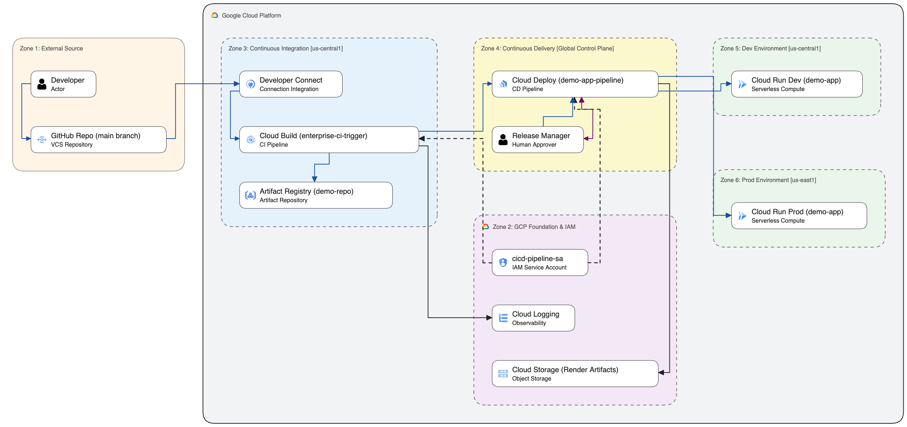

# Enterprise CI/CD on Google Cloud (Demo)

This repository contains the source code, templates, and instructions to demo a fully serverless, enterprise-grade CI/CD pipeline on Google Cloud.

It demonstrates deploying a FastAPI (Python) application from GitHub to Cloud Run. It covers the full software delivery lifecycle: automated testing, container security scanning, binary authorization, deployment verification, and progressive (canary) delivery to production.

## Architecture



---

### Best Practices Implemented
* **Separation of CI and CD:** Cloud Build handles CI (lint, test, build, scan) while Cloud Deploy handles CD (verify, promote, approve).
* **Automated Testing & Linting:** Code is validated with `pytest` and linted with `ruff` *before* a container is ever built.
* **Container Vulnerability Scanning:** Images are scanned with On-Demand Scanning immediately after pushing to Artifact Registry.
* **Deployment Verification:** After each deployment to Dev and Prod, Cloud Deploy automatically runs a live health check against the running service endpoint before marking the deployment stable.
* **Canary Deployments (Prod):** Production rollouts use a canary strategy (10% → 50% → 100%), allowing safe progressive traffic shifting with health verification at each phase.
* **Human-in-the-Loop (Prod Approval):** A manual approval gate in Cloud Deploy ensures no code reaches production without an authorized sign-off.
* **Developer Connect:** Uses Google's V2 API to securely connect GitHub to Google Cloud.
* **Least Privilege Security:** Cloud Build and Cloud Deploy execute using a custom Service Account with only the roles they need.
* **Supply Chain Security (Binary Authorization):** Cloud Run enforces a policy that only permits images built by this CI pipeline stored in the approved Artifact Registry.

---

## Repository Structure

* `src/main.py` - The FastAPI web application with `/` and `/health` endpoints.
* `tests/test_main.py` - Unit tests for the application endpoints.
* `Dockerfile` - Container configuration running `uvicorn`.
* `cloudbuild.yaml` - Cloud Build CI pipeline: lint → test → build → push → scan → create release.
* `service.yaml` - The Cloud Run Knative service manifest.
* `skaffold.yaml` - Tells Cloud Deploy how to render, deploy, and **verify** `service.yaml`.
* `clouddeploy.yaml` - Defines the delivery pipeline with Dev (verify) and Prod (canary + approval) stages.
* `binauthz-policy.yaml` - Binary Authorization policy allowing only images from Artifact Registry.

---

## Setup Instructions

To deploy this architecture in your own Google Cloud project, follow these steps using Google Cloud Shell or your local terminal authenticated with `gcloud`.

### 1. Set Environment Variables
```bash
export PROJECT_ID=$(gcloud config get-value project)
export DEV_REGION="us-central1"
export PROD_REGION="us-east1"
export SA_NAME="cicd-pipeline-sa"
export SA_EMAIL="${SA_NAME}@${PROJECT_ID}.iam.gserviceaccount.com"
```

### 2. Enable Required Google Cloud APIs
```bash
gcloud services enable \
    cloudbuild.googleapis.com \
    artifactregistry.googleapis.com \
    run.googleapis.com \
    clouddeploy.googleapis.com \
    developerconnect.googleapis.com \
    secretmanager.googleapis.com \
    binaryauthorization.googleapis.com \
    ondemandscanning.googleapis.com
```

### 3. Create Custom Service Account & Grant Permissions
```bash
# Create the Service Account
gcloud iam service-accounts create $SA_NAME \
    --display-name="CI/CD Pipeline Service Account"

# Grant Artifact Registry Writer (to push images)
gcloud projects add-iam-policy-binding $PROJECT_ID \
    --member="serviceAccount:${SA_EMAIL}" \
    --role="roles/artifactregistry.writer"

# Grant Cloud Deploy permissions
gcloud projects add-iam-policy-binding $PROJECT_ID \
    --member="serviceAccount:${SA_EMAIL}" \
    --role="roles/clouddeploy.releaser"
gcloud projects add-iam-policy-binding $PROJECT_ID \
    --member="serviceAccount:${SA_EMAIL}" \
    --role="roles/clouddeploy.jobRunner"

# Grant Cloud Run deploy permissions
gcloud projects add-iam-policy-binding $PROJECT_ID \
    --member="serviceAccount:${SA_EMAIL}" \
    --role="roles/run.admin"
gcloud projects add-iam-policy-binding $PROJECT_ID \
    --member="serviceAccount:${SA_EMAIL}" \
    --role="roles/iam.serviceAccountUser"

# Grant On-Demand Scanning permissions (Required for Vulnerability Scan)
gcloud projects add-iam-policy-binding $PROJECT_ID \
    --member="serviceAccount:${SA_EMAIL}" \
    --role="roles/ondemandscanning.admin"

# Grant Cloud Run Invoker permissions (Required for Cloud Deploy Verification)
# The verification job calls your live Cloud Run service URL to confirm it's healthy.
gcloud projects add-iam-policy-binding $PROJECT_ID \
    --member="serviceAccount:${SA_EMAIL}" \
    --role="roles/run.invoker"

# Grant Logging and Storage permissions (Required by Cloud Build and Cloud Deploy)
gcloud projects add-iam-policy-binding $PROJECT_ID \
    --member="serviceAccount:${SA_EMAIL}" \
    --role="roles/logging.logWriter"
gcloud projects add-iam-policy-binding $PROJECT_ID \
    --member="serviceAccount:${SA_EMAIL}" \
    --role="roles/storage.admin"
```

### 4. Create the Artifact Registry
```bash
gcloud artifacts repositories create demo-repo \
    --repository-format=docker \
    --location=$DEV_REGION \
    --description="Enterprise Demo Docker repo"
```

### 5. Apply Cloud Deploy Pipeline Configuration
This creates the logical pipeline connecting the Dev and Prod environments. 
Substitutes `$PROJECT_ID` into `clouddeploy.yaml` and applies the pipeline configuration:

```bash
envsubst < clouddeploy.yaml | gcloud deploy apply --file=- --region=$DEV_REGION
```

### 6. Connect GitHub to Google Cloud
1. Go to **Developer Connect** in the Google Cloud Console.
2. Click **Create Connection** -> select **GitHub**.
3. Name it `github-conn`, choose region `us-central1`, and follow the prompts to authorize your repository.

### 7. Create the Cloud Build Trigger
1. Go to **Cloud Build > Triggers** in the console and click **Create Trigger**.
2. **Name:** `enterprise-ci-trigger`
3. **Event:** Push to branch (regex: `^main$`)
4. **Source Generation:** `2nd gen (Developer Connect)` -> Select your repo.
5. **Configuration:** `Cloud Build configuration file (yaml or json)` -> `/cloudbuild.yaml`
6. **Advanced > Service Account:** Select `CI/CD Pipeline Service Account`.
7. Click **Create**.

### 8. Configure Binary Authorization
To prevent any unauthorized images from running in your environment, create a policy that explicitly denies everything except images originating from your Artifact Registry.

```bash
cat <<EOF > binauthz-policy.yaml
defaultAdmissionRule:
  evaluationMode: ALWAYS_DENY
  enforcementMode: ENFORCED_BLOCK_AND_AUDIT_LOG
admissionWhitelistPatterns:
- namePattern: "${DEV_REGION}-docker.pkg.dev/${PROJECT_ID}/demo-repo/*"
EOF

gcloud container binauthz policy import binauthz-policy.yaml
```

**Important:** Ensure your `service.yaml` file in GitHub includes the Binary Authorization annotation so the service enforces the policy:
```yaml
apiVersion: serving.knative.dev/v1
kind: Service
metadata:
  name: demo-app
  annotations:
    run.googleapis.com/binary-authorization: default
spec:
  template:
    spec:
      containers:
      - image: my-app-image
```

---

## Running the Demo

### Part 1: The CI Phase (Cloud Build)
1. **Trigger a deployment:** Make a visible change to `src/main.py` (e.g., update the version string), commit, and push to the `main` branch.
2. **Watch the CI phase:** Open **Cloud Build > History** in the GCP console. Observe each step executing in sequence:
   * **Lint:** `ruff` validates code style.
   * **Test:** `pytest` runs unit tests against the application.
   * **Build & Push:** Docker image built and pushed to Artifact Registry.
   * **VulnerabilityScan:** Image scanned for known CVEs.
   * **Deploy:** A new Cloud Deploy release is created.

### Part 2: The CD Phase (Cloud Deploy)
3. **Open Cloud Deploy** in the console and click `demo-app-pipeline`. Watch the `dev-env` stage:
   * The service deploys to Cloud Run.
   * Cloud Deploy automatically runs the **Verification** job — a live `curl` against your `/health` endpoint. If it returns 200 OK, the deployment is marked stable.
4. **The Human-in-the-Loop:** Notice the pipeline is paused at `prod-env` with a **Review** button.
5. **Approve the Canary:** Click **Review**, then **Approve**. Cloud Deploy uses the **Canary strategy**:
   * **10% of traffic** is routed to the new version. Verification runs at 10%.
   * Promote to **50%**, verification runs again.
   * Promote to **stable (100%)** — rollout complete!

### Part 3: Supply Chain Security (Binary Authorization)
Demonstrate zero-trust by attempting to bypass the pipeline and deploy an unauthorized image directly:

```bash
gcloud run deploy rogue-app \
    --image=nginx:latest \
    --binary-authorization=default \
    --region=us-central1 \
    --allow-unauthenticated
```

**The Result:** The deployment fails immediately:
> `Deny by default admission rule. Image nginx:latest is not allowed by the policy.`

This proves only images that have passed through your secure CI pipeline can run in your environment.